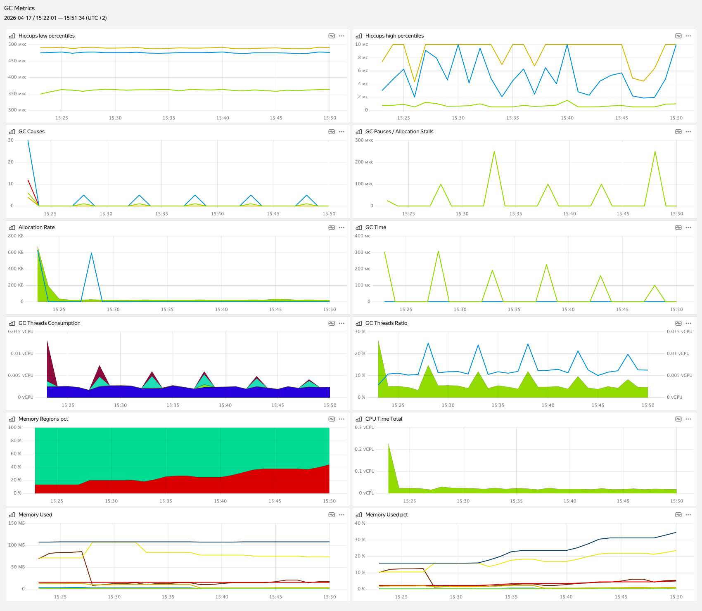

# otel-metrics-jvm

Небольшая библиотека для экспорта JVM-метрик в OpenTelemetry (JMX, JFR, hiccup-meter) для анализа производительности сборщика мусора.

## Подключение

Артефакт доступен через [JitPack](https://jitpack.io/#raipc/otel-metrics-jvm/0.1.0). Добавьте репозиторий JitPack и зависимость.

### Gradle (Kotlin DSL)

В `settings.gradle.kts` (или в `dependencyResolutionManagement` корневого проекта):

```kotlin
dependencyResolutionManagement {
	repositories {
		mavenCentral()
		maven { url = uri("https://jitpack.io") }
	}
}
```

В `build.gradle.kts` модуля:

```kotlin
dependencies {
	implementation("com.github.raipc:otel-metrics-jvm:0.1.0")
}
```

### Gradle (Groovy)

```groovy
repositories {
	mavenCentral()
	maven { url "https://jitpack.io" }
}

dependencies {
	implementation "com.github.raipc:otel-metrics-jvm:0.1.0"
}
```

### Maven

```xml
<repositories>
	<repository>
		<id>jitpack.io</id>
		<url>https://jitpack.io</url>
	</repository>
</repositories>

<dependency>
	<groupId>com.github.raipc</groupId>
	<artifactId>otel-metrics-jvm</artifactId>
	<version>0.1.0</version>
</dependency>
```

## Демо-приложение и отправка метрик в Monium

Пример интеграции со Spring Boot — репозиторий [raipc/spring-petclinic](https://github.com/raipc/spring-petclinic).

Метрики экспортируются в формате OpenTelemetry. В качестве приёмника может выступать любая система с поддержкой OTLP. Ниже пример для экспорта метрик в [Monium](https://yandex.cloud/ru/docs/monium/collector/project) (требуется задать `MONIUM_PROJECT` и `MONIUM_API_KEY`)

```bash
OTEL_EXPORTER_OTLP_PROTOCOL="grpc" \
OTEL_EXPORTER_OTLP_ENDPOINT="https://ingest.monium.yandex.cloud:443" \
OTEL_EXPORTER_OTLP_HEADERS="x-monium-project=${MONIUM_PROJECT},authorization=Api-Key ${MONIUM_API_KEY}" \
OTEL_EXPORTER_OTLP_METRICS_TEMPORALITY_PREFERENCE=delta \
OTEL_SERVICE_NAME=java-metrics-demo \
java -Dotel.java.global-autoconfigure.enabled=true -Dotel.instrumentation.runtime-telemetry.capture-gc-cause=true --add-opens=java.management/sun.management=ALL-UNNAMED -jar target/*.jar
```

В этом репозитории доступен готовый JSON дашборда для метрик GC — [`gc-metrics-dashboard.json`](gc-metrics-dashboard.json). Его можно импортировать в Monium (Дашборды -> Создать -> Настройки -> JSON) и использовать для визуализации GC метрик в едином месте.



## Метрики

### JMX: `JvmGc`

| Имя | Тип | Единица | Описание |
|-----|-----|---------|----------|
| `jvm.gc.count` | Counter | 1 | Суммарное число сборок по каждому коллектору (`GarbageCollectorMXBean`). |
| `jvm.gc.time` | Counter | ms | Суммарное время сборок по каждому коллектору. |

Атрибуты: `jvm.gc.name`, `instrumentation.source=jmx`.

### JMX: `JvmGcPromotions`

| Имя | Тип | Единица | Описание                                                                                                                  |
|-----|-----|---------|---------------------------------------------------------------------------------------------------------------------------|
| `jvm.gc.promotion` | Counter | By | Апроксимированный объём данных, перемещённых из молодого поколения в старое, по событиям GC (Parallel, G1, GenShen, ZGC). |

### JMX: `JvmThreadsCpu`

| Имя | Тип | Единица | Описание |
|-----|-----|---------|----------|
| `jvm.thread.cpu_time` | Counter | ns | Накопленное CPU-время по пулу (`thread.pool.name`). |
| `jvm.thread.cpu_time.total` | Counter | ns | То же по всем пулам (без `thread.pool.name`). |
| `jvm.thread.count` | Gauge | 1 | Число потоков по пулу. |
| `jvm.thread.count.total` | Gauge | 1 | Число потоков по всем пулам. |
| `jvm.thread.allocated_bytes` | Counter | By | Накопленные аллокации по пулу (только для Java-потоков, где доступен учёт). |
| `jvm.thread.allocated_bytes.total` | Counter | By | Накопленные аллокации по всем пулам. |
| `jvm.gc.thread.cpu_time` | Counter | ns | Накопленное CPU-время GC-потоков (если включена агрегация по внутренним VM-потокам). |
| `jvm.gc.thread.count` | Gauge | 1 | Число GC-потоков (при той же опции). |

Атрибут `thread.pool.name` — только у метрик без суффикса `.total`.

### JFR: `JfrGarbageCollection`

| Имя | Тип | Единица | Описание |
|-----|-----|---------|----------|
| `jvm.gc.pause` | Histogram | µs | Сумма пауз внутри одного события GC (`jdk.GarbageCollection`). |
| `jvm.gc.longest_pause` | Histogram | µs | Самая длинная пауза в событии. |

Атрибуты: `jvm.gc.name`, `jvm.gc.cause`, `instrumentation.source=jfr`.  

### JFR: `JfrAllocationStall` (ZGC)

| Имя | Тип | Единица | Описание |
|-----|-----|---------|----------|
| `jvm.gc.allocation_stall` | Histogram | us | Длительность allocation stall (`jdk.ZAllocationStall`). |

Атрибуты: `thread.pool.name`, `instrumentation.source=jfr`.

### Hiccups: `JvmHiccups`

| Имя | Тип | Единица | Описание               |
|-----|-----|---------|------------------------|
| `jvm.hiccup.duration` | Histogram | us | Платформенные хиккапы. |

## JVM-опции для метрик по внутренним (VM) потокам

Чтобы `JvmThreadsCpu` мог читать CPU внутренних потоков HotSpot через `HotspotThreadMBean` (агрегация GC-потоков и/или учёт внутренних потоков в пулах), процесс должен быть запущен с открытием пакета:

```text
--add-opens=java.management/sun.management=ALL-UNNAMED
```

Без этой опции загрузка `getInternalThreadCpuTimes` не удаётся, и метрики `jvm.gc.thread.*` при включённой агрегации GC, а также распределение внутренних VM-потоков по пулам, будут недоступны (в лог пишется предупреждение).

Дополнительно для **Java**-потоков:

- **CPU по потоку** — если `ThreadMXBean.getThreadCpuTime` возвращает `-1`, включите учёт: `-XX:+ThreadCpuTime` (в многих сборках HotSpot уже включён).
- **Аллокации по потоку** — нужен `com.sun.management.ThreadMXBean`; при отсутствии поддержки или отключённом учёте аллокации не попадут в `jvm.thread.allocated_bytes`. При необходимости: `-XX:+EnableThreadAllocatedMemory` (в актуальных JDK включено по умолчанию).

JFR-стрим (`JfrMetrics`, обработчики `JfrGarbageCollection`, `JfrAllocationStall`) опирается на встроенный в JDK механизм JFR; для continuous streaming обычно достаточно стандартной конфигурации JDK 17+. JFR стримы пишутся на диск и читаются с него, потому в случае медленного или нестбильного диска рассмотрите возможность отключить метрики JFR или перенести запись JFR стрима (по умолчанию в TMPDIR) на RAM диск.

## Пример подключения (Spring Boot)
В контексте должен лежать бин OpenTelemetry. Настроить его можно через добавление `io.opentelemetry.instrumentation:opentelemetry-spring-boot-starter`.

```java
@Configuration(proxyBeanMethods = false)
class MetricsConfiguration {
	@Bean
	ThreadPoolNameExtractor threadPoolNameExtractor() {
		return new NumRemovingThreadPoolNameExtractor();
	}

	@Bean(initMethod = "start")
	JfrMetrics jfrMetrics(OpenTelemetry openTelemetry, ThreadPoolNameExtractor extractor) {
		Meter meter = openTelemetry.getMeter("jvm-metrics-ext");
		List<JfrEventHandler> handlers = JfrAllocationStall.isApplicable()
				? List.of(new JfrGarbageCollection(meter), new JfrAllocationStall(meter, extractor))
				: List.of(new JfrGarbageCollection(meter));
		return new JfrMetrics(handlers);
	}

	@Bean
	JvmThreadsCpu jvmThreadsCpu(OpenTelemetry openTelemetry, ThreadPoolNameExtractor extractor) {
		Meter meter = openTelemetry.getMeter("jvm-metrics-ext");
		return new JvmThreadsCpu(meter, extractor);
	}

	@Bean
	JvmHiccups jvmHiccups(OpenTelemetry openTelemetry) {
		Meter meter = openTelemetry.getMeter("jvm-metrics-ext");
		return new JvmHiccups(meter);
	}

    @Bean
    JvmGcPromotions jvmGcPromotions(OpenTelemetry openTelemetry) {
        Meter meter = openTelemetry.getMeter("jvm-metrics-ext");
        return new JvmGcPromotions(meter);
    }

    @Bean
    JvmGc jvmGc(OpenTelemetry openTelemetry) {
        Meter meter = openTelemetry.getMeter("jvm-metrics-ext");
        return new JvmGc(meter);
    }
}
```